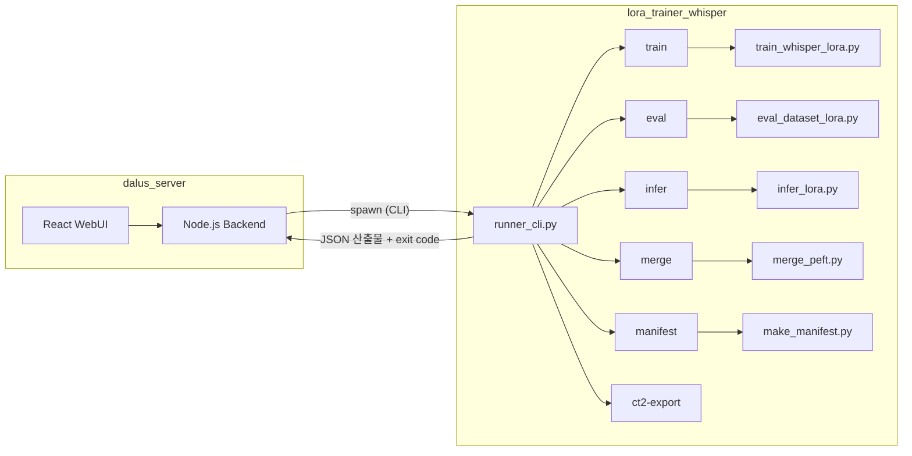
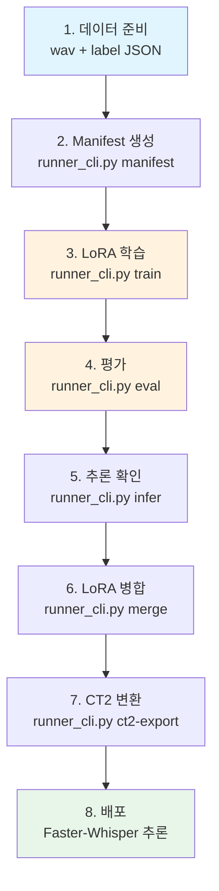
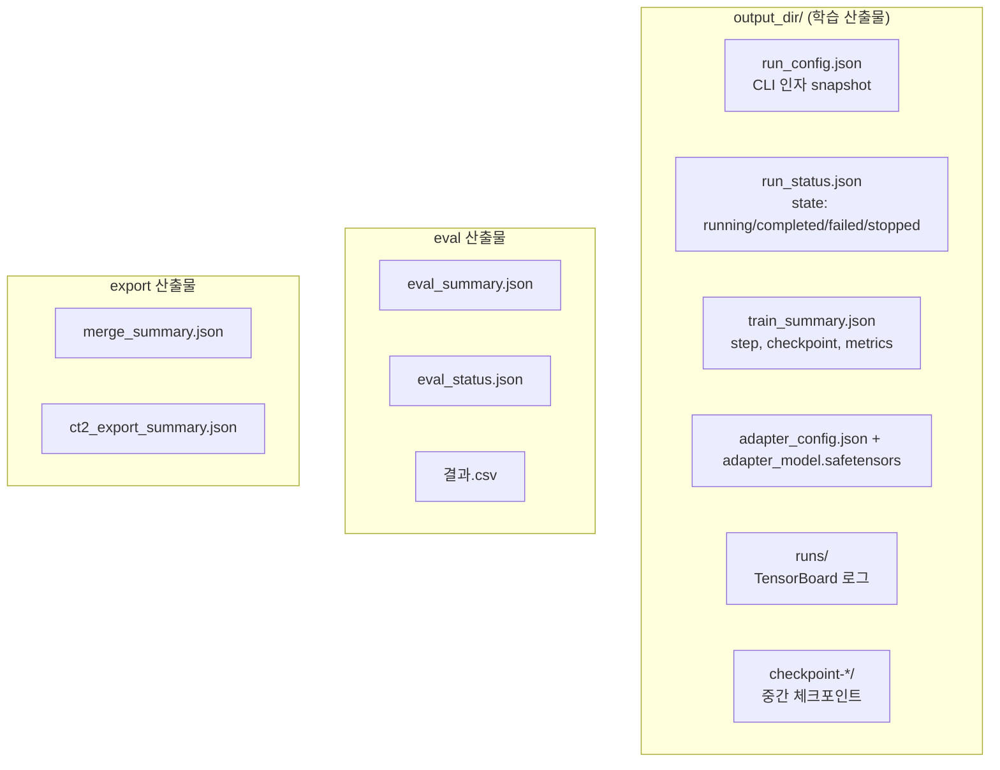
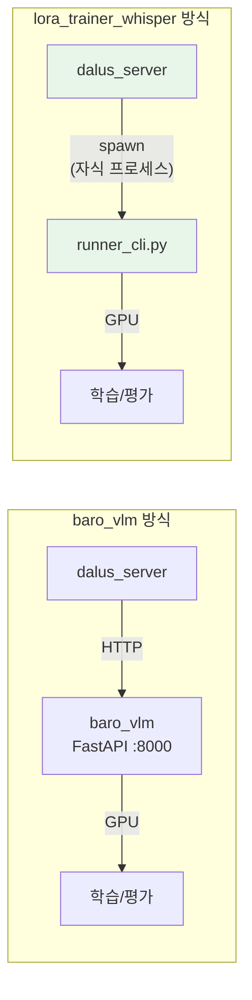

# Whisper LoRA Trainer

Whisper 모델의 **LoRA 파인튜닝, 평가, 추론, 모델 병합, CT2 변환**을 수행하는 학습 엔진입니다.
`dalus_server` WebUI가 이 저장소의 `runner_cli.py`를 CLI 프로세스로 호출하여 모든 워크플로우를 제어합니다.

이 저장소는 `uv` 기반으로 운영합니다. 문서의 모든 예시는 기본적으로 `uv run ...` 기준입니다.

## 현재 버전

- `0.1.0`

## 아키텍처



### 워크플로우



## 기술 스택

| 구분 | 내용 |
|------|------|
| Base Model | 기본값 `openai/whisper-large-v3` |
| Fine-tuning | LoRA (PEFT) + optional 8-bit quantization |
| 추론 변환 | CTranslate2 (Faster-Whisper) |
| 패키지 관리 | `uv` (Astral) |
| Python | >= 3.11 |
| GPU | CUDA (cu130, DGX Spark / ARM64 지원) |

## 프로젝트 구조

```
lora_trainer_whisper/
├── runner_cli.py              # dalus_server가 호출하는 통합 CLI 진입점
├── workflow_utils.py          # JSON 기록, 타임스탬프, checkpoint 유틸리티
│
├── train_whisper_lora.py      # LoRA 학습 본체
├── eval_dataset_lora.py       # manifest 기반 Base vs LoRA 비교 평가
├── infer_lora.py              # 단일 wav 추론
├── make_manifest.py           # 데이터셋 manifest.jsonl 생성
├── merge_peft.py              # LoRA adapter → base model 병합
├── test_run_ct2.py            # CT2 변환 모델 스모크 테스트
├── eval_dataset_ct2.py        # PyTorch vs CT2 비교 평가
├── compare_infer.py           # Base vs LoRA 추론 비교 (개발용)
├── check.py                   # 환경/CUDA/torchcodec 검증
│
├── setup.sh                   # uv 기반 환경 부트스트랩
├── pyproject.toml             # 의존성 및 PyTorch CUDA 인덱스 설정
├── datasets/                  # 입력 데이터셋 + manifest (git-ignored)
└── outputs/                   # 학습 산출물, 체크포인트 (git-ignored)
```

## 설치

### 사전 요구 사항

- Python >= 3.11
- CUDA 지원 GPU
- [uv](https://docs.astral.sh/uv/) 패키지 관리자
- 시스템 패키지: `pkg-config`, `cmake`, `ffmpeg` 관련 dev 라이브러리

### 시스템 패키지 설치

```bash
sudo apt update
sudo apt install -y pkg-config cmake build-essential \
    libavcodec-dev libavformat-dev libavutil-dev libswscale-dev \
    libavfilter-dev libavdevice-dev
```

### 의존성 설치

```bash
sh setup.sh
```

또는 수동으로:

```bash
uv venv
uv pip install cmake ninja pybind11 setuptools wheel

export CUDACXX=/usr/local/cuda/bin/nvcc
export PATH=/usr/local/cuda/bin:$PATH
PYBIND_PATH=$(uv run python -c "import pybind11; print(pybind11.get_cmake_dir())")
export CMAKE_PREFIX_PATH=$PYBIND_PATH:$CMAKE_PREFIX_PATH

UV_HTTP_TIMEOUT=600 \
I_CONFIRM_THIS_IS_NOT_A_LICENSE_VIOLATION=1 \
uv sync --no-build-isolation
```

### 환경 확인

```bash
uv run python check.py
```

## runner_cli.py — 통합 CLI 진입점

`dalus_server`가 이 저장소를 제어하는 표준 인터페이스입니다.
모든 작업은 `uv run python runner_cli.py <subcommand> [options]` 형식으로 실행합니다.

### 호출 규약

- 성공 시 exit code `0`, stdout에 결과 JSON 출력
- 실패 시 exit code `!= 0`, stderr에 에러 메시지 + 산출물 디렉토리에 상태 JSON 기록
- 장기 작업은 상태 JSON을 기록합니다. 학습은 `run_status.json`, 평가는 `eval_status.json`을 사용합니다.

### 서브커맨드 목록

| 서브커맨드 | 설명 | 장기 실행 |
|-----------|------|----------|
| `manifest` | 데이터셋 manifest.jsonl 생성 | No |
| `train` | LoRA 학습 시작 | Yes |
| `eval` | Base vs LoRA 비교 평가 | Yes |
| `infer` | 단일 wav 추론 | No |
| `merge` | LoRA adapter를 base model에 병합 | No |
| `ct2-export` | CTranslate2 추론 모델로 변환 | No |

### manifest

```bash
uv run python runner_cli.py manifest \
  --root ./datasets/Sample \
  --wav-dir wav \
  --label-dir lb \
  --output manifest.jsonl \
  --audio-path-mode relative \
  --workers 16
```

| 옵션 | 기본값 | 설명 |
|------|--------|------|
| `--root` | (필수) | 데이터셋 루트 경로 |
| `--wav-dir` | `wav` | 오디오 폴더명 |
| `--label-dir` | `lb` | 라벨 폴더명 |
| `--output` | `manifest.jsonl` | 출력 파일명 (root 기준 상대 경로) |
| `--audio-path-mode` | `relative` | `audio` 필드를 `manifest.jsonl` 기준 상대경로 또는 절대경로로 저장 |
| `--workers` | `16` | 라벨 JSON 읽기 병렬 worker 수 |

- 기본값인 `relative`를 권장합니다. symlink, 외장 디스크, 마운트 위치가 바뀌어도 manifest를 다시 덜 만들게 됩니다.
- train/eval 스크립트는 relative/absolute 두 형식을 모두 읽을 수 있도록 처리합니다.

### train

```bash
uv run python runner_cli.py train \
  --model-name openai/whisper-large-v3 \
  --manifest datasets/Sample/manifest.jsonl \
  --output-dir outputs/small_lora \
  --batch-size 16 --grad-accum 2 --max-steps 300 \
  --fp16 --lr 1e-4
```

| 옵션 | 기본값 | 설명 |
|------|--------|------|
| `--model-name` | `openai/whisper-large-v3` | Hugging Face 모델 ID |
| `--manifest` | (필수) | 학습 manifest 경로 |
| `--output-dir` | (필수) | 산출물 디렉토리 |
| `--language` | `ko` | 언어 코드 |
| `--task` | `transcribe` | 작업 유형 |
| `--max-steps` | `300` | 최대 학습 스텝 |
| `--batch-size` | `2` | 배치 크기 |
| `--grad-accum` | `16` | Gradient Accumulation |
| `--lr` | `1e-4` | 학습률 |
| `--seed` | `42` | 랜덤 시드 |
| `--fp16` | off | FP16 혼합 정밀도 |
| `--max-audio-sec` | `20.0` | 최대 오디오 길이(초) |
| `--use-gradient-checkpointing` | off | 메모리 절약용 |
| `--lora-r` | `8` | LoRA rank |
| `--lora-alpha` | `16` | LoRA alpha |
| `--lora-dropout` | `0.05` | LoRA dropout |
| `--target-modules` | `q_proj,v_proj` | LoRA 적용 모듈 |
| `--eval-manifest` | (비워두면 자동 분할) | 별도 eval manifest |
| `--eval-steps` | `300` | eval 주기(스텝) |
| `--eval-ratio` | `0.01` | eval-manifest 없을 때 자동 분할 비율 |
| `--load-in-8bit` | off | 8-bit 양자화 로딩 |

멀티 GPU 학습은 `torchrun`으로 개별 스크립트를 직접 호출합니다:

```bash
uv run torchrun --nproc_per_node=2 train_whisper_lora.py \
  --model_name openai/whisper-large-v3 \
  --manifest /path/to/Training/manifest.jsonl \
  --eval_manifest /path/to/Validation/manifest.jsonl \
  --output_dir outputs/large_v3_ddp \
  --batch_size 32 --grad_accum 4 --fp16 --lr 1e-4 \
  --use_gradient_checkpointing --max_audio_sec 30.0 \
  --eval_steps 300 --max_steps 3000
```

### eval

```bash
uv run python runner_cli.py eval \
  --manifest datasets/Sample/manifest.jsonl \
  --base-model openai/whisper-large-v3 \
  --lora-dir outputs/small_lora \
  --output-csv outputs/eval_results.csv \
  --max-samples 200
```

| 옵션 | 기본값 | 설명 |
|------|--------|------|
| `--manifest` | (필수) | 평가 manifest 경로 |
| `--base-model` | `openai/whisper-large-v3` | 베이스 모델 |
| `--lora-dir` | (필수) | adapter 또는 checkpoint 경로 |
| `--output-csv` | (필수) | 결과 CSV 저장 경로 |
| `--language` | `ko` | 언어 코드 |
| `--max-samples` | `200` | 최대 평가 샘플 수 |
| `--max-new-tokens` | `128` | 생성 최대 토큰 |
| `--disable-adapter` | off | adapter 없이 base만 평가 (진단용) |

### infer

```bash
uv run python runner_cli.py infer \
  --wav /path/to/audio.wav \
  --base-model openai/whisper-large-v3 \
  --lora-dir outputs/small_lora \
  --compare-base \
  --result-json /tmp/result.json
```

| 옵션 | 기본값 | 설명 |
|------|--------|------|
| `--wav` | (필수) | 입력 오디오 파일 |
| `--base-model` | `openai/whisper-large-v3` | 베이스 모델 |
| `--lora-dir` | (필수) | adapter 경로 |
| `--language` | `ko` | 언어 코드 |
| `--compare-base` | off | base 결과도 함께 출력 |
| `--result-json` | (선택) | 결과를 JSON 파일로 저장 |

### merge

```bash
uv run python runner_cli.py merge \
  --base-model openai/whisper-large-v3 \
  --lora-dir outputs/small_lora \
  --merged-dir outputs/merged_small
```

### ct2-export

```bash
uv run python runner_cli.py ct2-export \
  --model-dir outputs/merged_small \
  --output-dir outputs/ct2_small \
  --quantization int8_float16
```

`--quantization` 옵션: 가중치를 8비트로 줄이고 연산은 16비트로 하여 속도와 정확도를 잡습니다.

## 산출물 규약

`dalus_server`는 이 파일들을 읽어서 UI에 상태를 표시합니다.



### 학습 산출물 (`output_dir/`)

| 파일 | 설명 |
|------|------|
| `run_config.json` | 실행 당시 CLI 인자 snapshot |
| `run_status.json` | 현재 상태 (`running`, `completed`, `failed`, `stopped`) |
| `train_summary.json` | 학습 완료 후 요약 (step, checkpoint, metrics) |
| `adapter_config.json` | PEFT adapter 설정 |
| `adapter_model.safetensors` | 학습된 LoRA 가중치 |
| `runs/` | TensorBoard 로그 |
| `checkpoint-*/` | 중간 체크포인트 |

#### run_status.json 필드

```json
{
  "state": "running | completed | failed | stopped",
  "output_dir": "/absolute/path",
  "latest_checkpoint": "checkpoint-300",
  "checkpoint_count": 1,
  "tensorboard_log_dir": "/absolute/path/runs",
  "started_at": "2026-04-02T00:00:00Z",
  "updated_at": "2026-04-02T00:10:00Z",
  "pid": 12345,
  "message": "Training completed"
}
```

### 평가 산출물

| 파일 | 설명 |
|------|------|
| `eval_summary.json` | 평가 결과 요약 (CER, 샘플 수) |
| `eval_status.json` | 평가 진행 상태 |
| `*.csv` | 샘플별 비교 결과 |

참고:
- 현재 소스 기준으로 장기 실행 상태 파일은 학습은 `run_status.json`, 평가는 `eval_status.json`입니다.
- `infer`는 `--result-json`을 넘겼을 때만 JSON 파일을 추가로 기록합니다.

### 병합/변환 산출물

| 파일 | 설명 |
|------|------|
| `merge_summary.json` | 병합 완료 정보 |
| `ct2_export_summary.json` | CT2 변환 완료 정보 |

## dalus_server 연동

> **baro_vlm과의 차이**: baro_vlm은 별도 FastAPI 서버(`api.py`)를 띄워야 하지만,
> 이 프로젝트는 **별도 API 서버가 없습니다**. dalus_server의 Node.js 백엔드가
> `runner_cli.py`를 자식 프로세스(spawn)로 직접 실행하는 구조입니다.



### 실행 방법

**dalus_server만 실행하면 됩니다. 별도 Python 서버를 띄울 필요 없습니다.**

```bash
# dalus_server 실행 (터미널 1개만 필요)
cd ~/work/dalus_server
npm run dev
```

dalus_server가 시작되면 `uv run python runner_cli.py ...` 형태로 이 저장소의 스크립트를 호출합니다.
`uv`가 자동으로 `.venv`를 찾아 올바른 Python 환경에서 실행하므로 별도 venv 활성화가 필요 없습니다.
브라우저에서 dalus_server WebUI에 접속하면 Experiments 탭에서 학습/평가/추론을 제어할 수 있습니다.

### 환경 변수 (dalus_server `.env`)

| 변수 | 기본값 | 설명 |
|------|--------|------|
| `WHISPER_PROJECT_ROOT` | `../lora_trainer_whisper` | 이 저장소 경로 |
| `WHISPER_OUTPUT_ROOT` | `{PROJECT_ROOT}/outputs` | 산출물 루트 |
| `WHISPER_UV_BIN` | `uv` (PATH에서 탐색) | uv 실행 경로 (보통 생략) |

### dalus_server API 엔드포인트 (experiments 라우터)

| 메서드 | 경로 | 설명 |
|--------|------|------|
| GET | `/capability` | Python/Torch/CUDA 상태, GPU 목록 |
| POST | `/train/start` | 학습 시작 |
| GET | `/train/status` | 학습 진행 상태 |
| POST | `/train/stop` | 학습 중지 (SIGTERM) |
| GET | `/train/runs` | output 디렉토리 목록 |
| GET | `/train/run-summary` | 특정 run 상세 정보 |
| GET | `/train/run-config` | 특정 run 설정 조회 |
| GET | `/checkpoints` | checkpoint 목록 |
| POST | `/eval/start` | 평가 시작 |
| GET | `/eval/status` | 평가 진행 상태 |
| POST | `/eval/stop` | 평가 중지 |
| POST | `/infer/run` | 단일 파일 추론 |
| POST | `/export/merge` | LoRA 병합 |
| POST | `/export/ct2` | CT2 변환 |
| POST | `/manifest/generate` | manifest.jsonl 생성 |
| POST | `/tensorboard/start` | TensorBoard 시작 |
| GET | `/tensorboard/status` | TensorBoard 상태 |
| POST | `/tensorboard/stop` | TensorBoard 중지 |

## 전체 워크플로우

워크플로우 다이어그램은 상단 [아키텍처](#아키텍처) 섹션을 참조하세요.

## TensorBoard

학습 로그는 `output_dir/runs/`에 기록됩니다.

```bash
tensorboard --logdir outputs/
```

dalus_server WebUI에서는 Training 탭의 TensorBoard 버튼으로 자동 시작/중지할 수 있습니다.

## GPU 전력 제한 (선택)

```bash
sudo nvidia-smi -i 1 -pl 280
```
